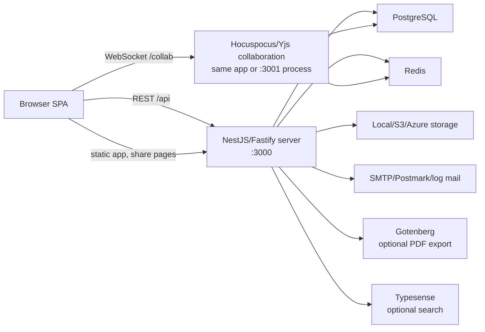

# KrattBook Architecture

KrattBook is a personal fork of Docmost. It keeps the upstream collaborative wiki/documentation architecture and currently customizes product identity, self-hosting defaults, and local deployment naming.

This document describes the current app shape as it exists in this repository. Use it as the first stop before changing routing, editor behavior, API modules, deployment, or shared packages.

## System Overview

KrattBook is a pnpm/Nx monorepo with three main source areas:

- `apps/client`: React 19, Vite, Mantine, React Router, TanStack Query, Jotai, Tiptap, Hocuspocus client, Yjs, and feature-oriented UI code.
- `apps/server`: NestJS 11 on Fastify, REST APIs, Socket.IO gateways, Hocuspocus collaboration server support, Kysely/PostgreSQL persistence, Redis-backed cache/queues/realtime adapters, storage, mail, import/export, security, and telemetry integration modules.
- `packages`: shared workspace libraries used by client and server.

At runtime the default self-hosted stack is:

The Docker Compose file starts one `krattbook` application container, PostgreSQL 18, and Redis 8. The application image builds both client and server, then runs `pnpm start`, which starts the production Nest server from `apps/server/dist/main`.

## Monorepo And Build

The root `package.json` defines the workspace and the most important commands:

- `pnpm dev`: runs the Vite client and Nest development server together.
- `pnpm build`: runs Nx builds across projects.
- `pnpm start`: runs the built production server.
- `pnpm collab` and `pnpm collab:dev`: run the standalone collaboration process from the server package.
- `pnpm clean`: removes app/package build output and Vite cache.

Nx target defaults are in `nx.json`. Builds are cached and depend on upstream package builds. The pnpm workspace includes `apps/*` and `packages/*`.

## Client Architecture

The client entrypoint is `apps/client/src/main.tsx`.

Main providers:

- `BrowserRouter` for route handling.
- `MantineProvider`, modals, notifications, and custom theme from `apps/client/src/theme.ts`.
- `QueryClientProvider` with TanStack Query defaults: no window refetch, no mount refetch, no retries, five-minute stale time.
- `HelmetProvider` for page metadata.
- `PostHogProvider` only when cloud mode and PostHog config are enabled.
- i18n bootstrapped from `apps/client/src/i18n.ts` and locale JSON under `apps/client/public/locales`.

Routes live in `apps/client/src/App.tsx`. Route-level pages are in `apps/client/src/pages`, while reusable domain UI and data hooks live under `apps/client/src/features`.

Primary client feature folders:

- `auth`: login, setup, invite signup, password reset, collaboration token query.
- `editor`: Tiptap editor, Yjs/Hocuspocus provider wiring, editor nodes, slash menu, toolbar, embeds, media, table, Draw.io, Excalidraw, Mermaid, transclusions, search/replace, and editor CSS.
- `page`, `page-details`, `page-history`: page loading, page metadata, history, and page mutations.
- `space`: space tree and space-level views.
- `comment`: inline comment dialogs and comment state.
- `attachments`: upload and attachment display concerns.
- `search`: global search and suggestions.
- `share`: public share layout and share reading flow.
- `workspace`, `user`, `group`, `session`, `label`, `favorite`, `notification`, `file-task`, `transclusion`, `websocket`.

Enterprise/cloud UI remains under `apps/client/src/ee`. Some routes always import EE components, and runtime behavior is gated by config such as `CLOUD`.

### Client Data Access

`apps/client/src/lib/api-client.ts` creates an Axios instance with:

- `baseURL: "/api"`
- `withCredentials: true`
- response unwrapping to `response.data`, except export endpoints that need headers
- 401 redirects to login except collaboration-token and public share flows
- self-hosted setup redirect when the server reports `workspace not found`

Configuration helpers are in `apps/client/src/lib/config.ts`. In development they read `process.env`; in production they read `window.CONFIG`. Important helpers include:

- `getAppName()`: currently returns `KrattBook`
- `getBackendUrl()`: current origin plus `/api`
- `getCollaborationUrl()`: resolves `COLLAB_URL` or the app origin, then converts to `ws`/`wss` at `/collab`
- `getDrawioUrl()`, file URL helpers, upload size limits, and PostHog helpers

### Editor And Collaboration Client

`apps/client/src/features/editor/page-editor.tsx` is the core collaborative editor component.

The editor uses:

- Tiptap and ProseMirror extensions from `features/editor/extensions`
- Yjs document names of the form `page.<pageId>`
- `y-indexeddb` for local persistence/offline recovery
- `@hocuspocus/provider` over WebSocket for remote sync
- `/api/auth/collab-token` to authorize collaboration sessions
- idle and document visibility detection to disconnect/reconnect sockets
- stateless Hocuspocus messages to update page metadata in the TanStack Query cache

The editor is intentionally split between core extensions, custom node views, menu components, and CSS modules/styles. When changing editor behavior, check both the extension registration and the corresponding node/menu component.

## Server Architecture

The main server entrypoint is `apps/server/src/main.ts`. It creates a Nest application with the Fastify adapter and imports `AppModule`.

Important bootstrap behavior:

- global API prefix is `/api`
- `robots.txt`, public share pages, and `mcp` are excluded from the `/api` prefix
- Socket.IO uses a Redis adapter through `WsRedisIoAdapter`
- Fastify plugins include multipart, cookies, and IP handling
- global validation uses `ValidationPipe` with whitelist, transform, and stop-at-first-error
- global responses pass through `TransformHttpResponseInterceptor`
- CORS and shutdown hooks are enabled
- iframe headers are applied unless disabled or excluded for files/share paths
- most `/api` requests require `workspaceId` resolved by middleware

`apps/server/src/app.module.ts` composes the application:

- request context and logging: `ClsModule`, `LoggerModule`
- audit: `NoopAuditModule` plus `AuditActorInterceptor`
- domain APIs: `CoreModule`
- persistence: `DatabaseModule`
- environment/config: `EnvironmentModule`
- Redis and global Redis-backed cache
- collaboration: `CollaborationModule`
- app realtime gateway: `WsModule`
- background jobs: `QueueModule`
- static client serving: `StaticModule`
- health, import, export, storage, mail, security, telemetry, throttle
- optional enterprise module loaded dynamically from `apps/server/src/ee/ee.module`

### Core Domain Modules

`apps/server/src/core/core.module.ts` imports the main product modules:

- `AuthModule`: login, setup, password changes/resets, token verification, logout, collaboration tokens.
- `WorkspaceModule`: workspace info/settings, members, invitations, hostname checks.
- `UserModule`: current user and profile update.
- `SessionModule`: user session listing/revocation.
- `PageModule`: page CRUD, labels, backlinks, recent pages, trash, history, sidebar pages, move, duplicate, breadcrumbs, page access, transclusion API.
- `SpaceModule`: spaces, space members, roles, trash views, and watcher endpoints.
- `AttachmentModule`: file upload/download, public files, image/icon serving, file info.
- `CommentModule`: create/list/info/update/delete comments.
- `SearchModule`: search, suggest, public share search.
- `GroupModule`: groups and group membership.
- `ShareModule`: share CRUD, public share page info/tree, SEO rendering.
- `LabelModule`: labels and labeled pages.
- `FavoriteModule`: favorite IDs and favorite pages.
- `NotificationModule`: notification list/count/read state.
- `WatcherModule`: page and space watch/unwatch state.
- `CaslModule` and `PageAccessModule`: permissions and authorization checks.

Most API controllers use `POST` for reads and writes, inheriting the upstream Docmost RPC-style API surface. Public health and file/share routes use `GET` where appropriate.

`CoreModule` applies:

- `DomainMiddleware` to resolve workspace/domain context
- `AuditContextMiddleware` to capture audit context

Both middlewares skip setup, health, and Stripe webhook routes.

### Database

The database layer uses Kysely with PostgreSQL through `kysely-postgres-js`.

`apps/server/src/database/database.module.ts`:

- configures the global Kysely connection with `CamelCasePlugin`
- reads `DATABASE_URL` and `DATABASE_MAX_POOL`
- retries startup connection up to 15 times
- runs migrations automatically on production bootstrap
- registers repository providers for workspaces, users, groups, spaces, pages, permissions, comments, favorites, attachments, sessions, shares, notifications, watchers, labels, templates, backlinks, transclusions, and history

Migrations live in `apps/server/src/database/migrations`. The generated table types live in `apps/server/src/database/types/db.d.ts`.

Important tables in the current generated DB interface include:

- core tenancy and identity: `workspaces`, `users`, `groups`, `groupUsers`, `workspaceInvitations`, `authAccounts`, `authProviders`, `userTokens`, `userSessions`, `userMfa`
- knowledge model: `spaces`, `spaceMembers`, `pages`, `pageHistory`, `pageAccess`, `pagePermissions`, `pageLabels`, `labels`, `backlinks`
- collaboration and page features: `comments`, `attachments`, `shares`, `favorites`, `watchers`, `notifications`, `pageTransclusions`, `pageTransclusionReferences`
- advanced/EE features: `billing`, `apiKeys`, `audit`, `templates`, `pageVerifications`, `pageVerifiers`, `scimTokens`, `aiChats`, `aiChatMessages`, `baseProperties`, `baseRows`, `baseViews`
- async/import support: `fileTasks`

Database scripts are in `apps/server/package.json`:

- `migration:create`
- `migration:up`
- `migration:down`
- `migration:latest`
- `migration:redo`
- `migration:reset`
- `migration:codegen`

### Collaboration Server

Collaboration is split across:

- `apps/server/src/collaboration`: Hocuspocus/Yjs collaboration behavior, authentication, persistence, history, Redis sync, and collaboration gateway.
- `apps/server/src/ws`: application Socket.IO gateway and Redis adapter for general realtime messages/tree updates.
- `apps/server/src/collaboration/server`: standalone collaboration server entrypoint and controller.

The standalone collaboration entrypoint is `apps/server/src/collaboration/server/collab-main.ts`. It starts a Fastify/Nest app on `COLLAB_PORT` or `3001`, sets a global `/api` prefix excluding `/`, and enables CORS. When `COLLAB_SHOW_STATS=true`, it also registers `/api/collab/stats`.

The client can connect either to the main app origin or to a separate collaboration origin via `COLLAB_URL`.

### Integrations

Integration modules under `apps/server/src/integrations` own infrastructure concerns:

- `environment`: typed accessors around `ConfigService` for app URL, secrets, database, Redis, storage, mail, Draw.io, Gotenberg, telemetry, search, AI, event store, iframe, and cloud/self-hosted mode.
- `storage`: local, S3, or Azure-backed file storage.
- `mail` and `transactional`: SMTP/Postmark/log mail and email templates.
- `queue`: BullMQ/Redis-backed background work.
- `import`: page import, zip import, and file task tracking.
- `export`: page and space export.
- `static`: production client/static asset serving.
- `health`: health and liveness endpoints.
- `security`: version and robots endpoints.
- `telemetry`: product telemetry, controlled by `DISABLE_TELEMETRY`.
- `throttle`: request throttling, backed by Redis.
- `audit`: OSS noop audit service, with EE audit available separately.

### Shared Packages

`packages/editor-ext` contains shared editor utilities and exports `sanitizeUrl`, used by the client for safe URLs.

`packages/base-formula` contains a spreadsheet/base formula engine with parser, tokenizer, AST, evaluator, function registry, type checking, formatting, graph, and client/server entrypoints. It is used by both client and server through workspace dependency aliases.

`packages/ee` contains enterprise-license material inherited from upstream. See the license section below before modifying or redistributing EE code.

## Request And Data Flows

### Authenticated Page Editing

1. Browser loads the SPA and routes to `/s/:spaceSlug/p/:pageSlug`.
2. Client page/query code fetches page data through `/api/pages/info`.
3. `PageEditor` creates a Yjs doc named `page.<pageId>`.
4. Local state syncs through IndexedDB.
5. Client fetches a collaboration token from `/api/auth/collab-token`.
6. Hocuspocus connects to `ws(s)://<origin>/collab` or `COLLAB_URL`.
7. Server authenticates the socket, loads/persists Yjs state, and broadcasts updates.
8. Page metadata updates flow back through stateless collaboration messages and normal REST mutations.

### Workspace-Scoped API Request

1. Browser calls `/api/...` with credentials.
2. Fastify/Nest receives the request.
3. `DomainMiddleware` resolves workspace/domain context and sets `workspaceId`.
4. A pre-handler rejects workspace-scoped API calls when no workspace is found.
5. Guards/decorators/services enforce auth and permissions.
6. Controllers validate DTOs and call services.
7. Services use repositories/Kysely, queues, storage, mail, and events as needed.
8. `TransformHttpResponseInterceptor` normalizes the response shape for the client.

### File Upload And Serving

1. Client sends multipart upload requests to attachment endpoints.
2. Server parses multipart data through Fastify multipart.
3. Storage service writes to local disk, S3, or Azure depending on `STORAGE_DRIVER`.
4. Metadata is stored in PostgreSQL.
5. Files are served through `/api/files/...`, `/api/files/public/...`, or image/icon routes.

## Configuration

The self-hosted minimum configuration is:

- `APP_URL`
- `APP_SECRET`
- `DATABASE_URL`
- `REDIS_URL`

Common optional configuration:

- `JWT_TOKEN_EXPIRES_IN`
- `DATABASE_MAX_POOL`
- `STORAGE_DRIVER`, `FILE_UPLOAD_SIZE_LIMIT`, `FILE_IMPORT_SIZE_LIMIT`
- S3: `AWS_S3_ACCESS_KEY_ID`, `AWS_S3_SECRET_ACCESS_KEY`, `AWS_S3_REGION`, `AWS_S3_BUCKET`, `AWS_S3_ENDPOINT`, `AWS_S3_FORCE_PATH_STYLE`, `AWS_S3_URL`
- Azure: `AZURE_STORAGE_ACCOUNT_NAME`, `AZURE_STORAGE_ACCOUNT_KEY`, `AZURE_STORAGE_CONTAINER`, `AZURE_STORAGE_ENDPOINT`, `AZURE_STORAGE_URL`
- mail: `MAIL_DRIVER`, `MAIL_FROM_ADDRESS`, `MAIL_FROM_NAME`, SMTP vars, `POSTMARK_TOKEN`
- editor/import/export: `DRAWIO_URL`, `GOTENBERG_URL`
- collaboration: `COLLAB_URL`, `COLLAB_PORT`, `COLLAB_DISABLE_REDIS`
- search: `SEARCH_DRIVER`, `TYPESENSE_URL`, `TYPESENSE_API_KEY`, `TYPESENSE_LOCALE`
- telemetry: `DISABLE_TELEMETRY`, `POSTHOG_HOST`, `POSTHOG_KEY`
- cloud/enterprise/billing: `CLOUD`, Stripe vars, SAML vars, AI vars, ClickHouse/event-store vars
- embedding: `IFRAME_EMBED_ALLOWED`, `IFRAME_ALLOWED_ORIGINS`
- debugging: `DEBUG_MODE`, `DEBUG_DB`, `LOG_HTTP`

See `.env.example` and `apps/server/src/integrations/environment/environment.service.ts` for the authoritative list. As of this document, `.env.example` still contains some upstream Docmost wording such as `MAIL_FROM_NAME=Docmost`; the server default has already been changed to `KrattBook`.

## Deployment

The included `Dockerfile` is a multi-stage build:

1. `base`: Node 22 slim with pnpm 10.4.0.
2. `builder`: installs all dependencies and runs `pnpm build`.
3. `installer`: copies built app/package artifacts, installs production dependencies, creates `/app/data/storage`, exposes port `3000`, and runs `pnpm start`.

The included `docker-compose.yml`:

- builds `krattbook:latest`
- starts PostgreSQL and Redis
- maps app port `3000:3000`
- mounts local storage at `/app/data/storage`
- uses named volumes for app storage, PostgreSQL, and Redis

Production migrations run automatically when the server boots with `NODE_ENV=production`.

## Testing And Quality

Available test commands:

- root build: `pnpm build`
- client test: `pnpm --filter ./apps/client test`
- client lint: `pnpm --filter ./apps/client lint`
- server unit tests: `pnpm --filter ./apps/server test`
- server e2e tests: `pnpm --filter ./apps/server test:e2e`

Server tests are Jest/ts-jest. Client tests are Vitest. Existing server specs cover page services/controllers, backlink behavior, transclusion utilities/controllers, and e2e app bootstrap.

Run focused tests around the domain you change. For editor/collaboration changes, also verify a real browser editing session because behavior spans Tiptap, IndexedDB, WebSocket auth, Yjs state, and server persistence.

## Fork Maintenance Notes

- The code still uses upstream package/import names such as `@docmost/db`, `@docmost/editor-ext`, and `@docmost/base-formula`. Treat these as internal workspace aliases unless there is a deliberate package rename effort.
- Enterprise folders remain in the tree and are imported dynamically or conditionally. Do not assume all `ee` code is active in self-hosted OSS mode.
- Product naming has been partially changed to KrattBook. Check user-visible strings, email defaults, static metadata, and Docker labels when continuing the rebrand.
- The API style is mostly POST-based RPC endpoints. Match the existing controller/service/DTO style for new domain operations.
- Keep database changes migration-first, then regenerate Kysely types with `pnpm --filter ./apps/server migration:codegen`.
- Avoid bypassing repositories for shared domain data unless the local module already does so; repositories are the common persistence boundary.
- Collaboration changes are high-risk because state exists in the browser, WebSocket sessions, Redis sync, PostgreSQL persistence, and page history.
- Static production serving is handled by the server. Client-only routes must keep working through server fallback/static behavior.
- The app has both self-hosted and cloud paths. Even for a personal fork, config gates such as `CLOUD`, `COLLAB_URL`, storage driver, and telemetry can affect runtime behavior.

## Where To Start For Common Changes

- Branding/app shell: `apps/client/src/lib/config.ts`, `apps/client/src/components/layouts/global`, public metadata, emails, Docker files, `.env.example`.
- Auth and setup: `apps/client/src/pages/auth`, `apps/client/src/features/auth`, `apps/server/src/core/auth`, `apps/server/src/core/workspace`.
- Page APIs: `apps/server/src/core/page`, `apps/server/src/database/repos/page`, `apps/client/src/features/page`.
- Editor nodes/menus: `apps/client/src/features/editor/extensions`, `apps/client/src/features/editor/components`, `packages/editor-ext`.
- Collaboration: `apps/client/src/features/editor/page-editor.tsx`, `apps/server/src/collaboration`, `apps/server/src/ws`.
- Spaces and permissions: `apps/server/src/core/space`, `apps/server/src/core/casl`, `apps/server/src/core/page/page-access`, `apps/client/src/features/space`.
- Import/export: `apps/server/src/integrations/import`, `apps/server/src/integrations/export`, `apps/client/src/components/common/export-modal.tsx`, `apps/client/src/features/file-task`.
- Storage/files: `apps/server/src/core/attachment`, `apps/server/src/integrations/storage`, `apps/client/src/features/attachments`.
- Search: `apps/server/src/core/search`, Typesense/search env vars, `apps/client/src/features/search`.
- Settings: `apps/client/src/pages/settings`, `apps/client/src/components/settings`, matching server modules for workspace, groups, spaces, shares, sessions, and account/user settings.

## Licensing Boundary

KrattBook inherits Docmost licensing boundaries:

- open-source core: AGPL 3.0
- enterprise directories subject to the upstream Docmost Enterprise license:
  - `apps/server/src/ee`
  - `apps/client/src/ee`
  - `packages/ee`
  - `packages/base-formula`

Keep this boundary visible when redistributing builds, copying code, or moving code between OSS and EE areas.
